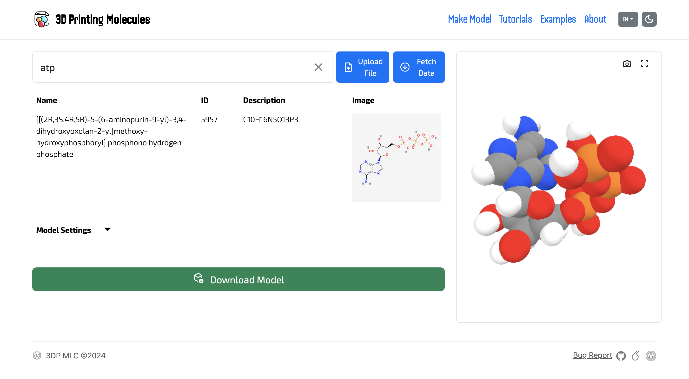
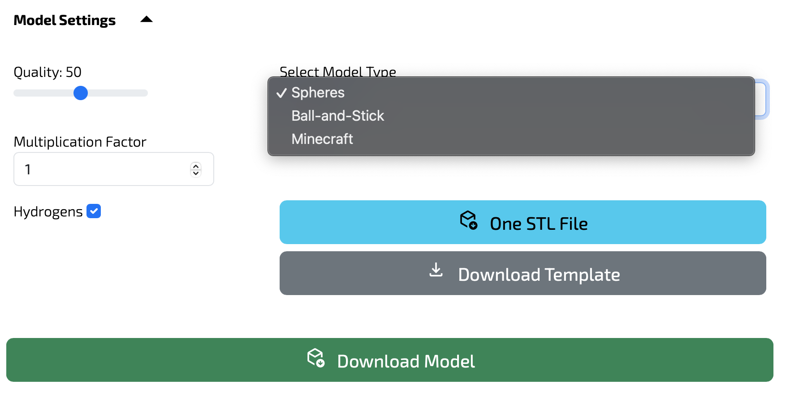

# 3D Print Molecules WEB

A web application for visualizing and preparing molecular structures for multicolour 3D printing. Easily prepare your molecule for printing.

## Description

This project provides a web interface for scientists, educators, and enthusiasts to visualize molecular structures and prepare them easily for 3D printing. Built with threejs, it offers an intuitive way to work with molecular models.

The program makes easier 3D printing muliticolour molecules by automatically separating and exporting of atoms of each kind and having superior quality of the mesh.

## Features

- Molecular structure visualization
- 3D printing preparation tools
- Interactive molecular model manipulation
- Support for common molecular file formats

## Getting Started

### Prerequisites

- Node.js (v16 or higher)
- npm or pnpm or yarn

### Installation

1. Clone the repository:
```bash
git clone https://github.com/yourusername/3D-Print-Molecules-WEB.git
cd 3D-Print-Molecules-WEB
```

2. Install dependencies:
```bash
npm install
```

3. Start the development server:
```bash
npm run dev -- --open
```

## Usage

The web application provides an intuitive interface for working with molecular structures.



### Step-by-Step Guide

1. **Upload Your Model**
   - Navigate to the web interface
   - Search for your molecule or
   - Click the "Upload File" button
   - Select your molecular structure file (supported formats: .sdf)

2. **Adjust Model Settings**
   - Use the settings panel on the right side to customize your model
   - Export to ZIP, where you can find all STLs



   - Available settings include:
     - Resolution settings for 3D printing
     - Display style (space-filling, ball-and-stick)
     - Atom size adjustment
     - Include hydrogen atoms

3. **Prepare for 3D Printing**
   - Once satisfied with the visualization, click "Download Model"
   - Import to your Slicer Software
   - Confirm ‘Multi-part object detected/An object with multiple parts was detected,’
   - Adjust the following 3D printing parameters:
     - Model scale
     - Support structure options
     - Layer height
     - Infill density
   - Preview the printable model

4. **3D Print Your Model**
   - Happy printing!

### Tips for Best Results
- For complex molecules, consider splitting the model into smaller parts
- Use support structures for overhanging atoms
- Adjust bond thickness based on your printer's capabilities
- Test print small sections before attempting full models

## Building for Production

To create a production build:

```bash
npm run build
```

Preview the production build with:
```bash
npm run preview
```

## Contributing

Contributions are welcome! Please feel free to submit a Pull Request.

1. Fork the project
2. Create your feature branch (`git checkout -b feature/AmazingFeature`)
3. Commit your changes (`git commit -m 'Add some AmazingFeature'`)
4. Push to the branch (`git push origin feature/AmazingFeature`)
5. Open a Pull Request

## License

[Add your license here]

## Contact

Your Name - [Your Email]

Project Link: [https://github.com/yourusername/3D-Print-Molecules-WEB](https://github.com/yourusername/3D-Print-Molecules-WEB)

## Acknowledgments

- SvelteKit
- ThreeJS
